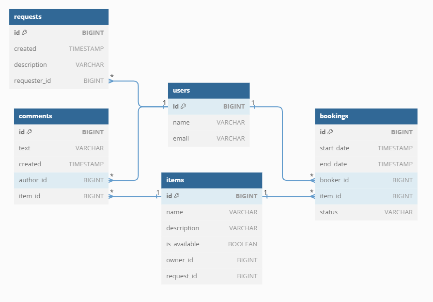

# Java-shareit project

Данный проект - сервис для шаринга (от англ. share — «делиться») вещей, он обеспечивает пользователям следующий функционал:
- возможность рассказывать, какими вещами они готовы поделиться;
- находить нужную вещь и брать её в аренду.

Сервис должен не только позволять бронировать вещь на определённые даты, но и закрывать к ней доступ на время 
бронирования от других желающих. На случай, если нужной вещи на сервисе нет, у пользователей должна быть возможность 
оставлять запросы на необходимые вещи. 
По запросу можно добавлять новые вещи для шаринга.

# Технологии
Java, SpringBoot, REST API, Maven, Postgresql, Doker, JUnit, MockMVC.

## Описание функционала
Приложение ShareIt состоит из двух частей, которые общаются друг с другом через REST: 
- server;
- gateway. 

Запуск ShareIt происходит через Docker. 
Server, gateway и БД PostgreSQL запускаются в отдельном Docker-контейнере как 
самостоятельное Java-приложение, а их взаимодействие настроено через Docker Compose.

> Server содержит всю основную логику.
> 
> Gateway содержит контроллеры, с которыми непосредственно работают пользователи, вместе с валидацией входных данных.

### 1. **ItemController**:
   - ***POST /items*** - добавление новой вещи. userId в заголовке X-Sharer-User-Id — это идентификатор пользователя, который добавляет вещь.
     Именно этот пользователь — владелец вещи. Идентификатор владельца будет поступать на вход в каждом из запросов, перечисленных далее.
   - ***PATCH /items/{itemId}*** - редактирование вещи. Изменить можно название, описание и статус доступа к аренде. 
    Редактировать вещь может только её владелец.
   - ***GET /items/{itemId}*** - просмотр информации о конкретной вещи по её идентификатору. Информацию о вещи может 
   просмотреть любой пользователь.
   - ***GET /items*** - просмотр владельцем списка всех его вещей с указанием названия и описания для каждой.
   - ***GET /items/search?text={text}*** - поиск вещи потенциальным арендатором. Пользователь передаёт в строке запроса текст,
   а приложение ищет вещи, содержащие этот текст в названии или описании, поиск возвращает только доступные для аренды вещи.

### 2. **BookingController**:
   - ***POST /bookings*** - запрос может быть создан любым пользователем, а затем подтверждён владельцем вещи, после создания
   запрос находится в статусе WAITING.
   - ***PATCH /bookings/{bookingId}*** - подтверждение или отклонение запроса на бронирование. Может быть выполнено только 
   владельцем вещи. Затем статус бронирования становится либо APPROVED, либо REJECTED.
   - ***GET /bookings/{bookingId}*** - получение данных о конкретном бронировании (включая его статус). Может быть выполнено 
   либо автором бронирования, либо владельцем вещи.
   - ***GET /bookings?state={state}*** - Получение списка всех бронирований текущего пользователя. Параметр state необязательный 
   и по умолчанию равен ALL (англ. «все»). Также он может принимать значения:
     - _CURRENT_ (англ. «текущие»),
     - _PAST_ (англ. «завершённые»), 
     - _FUTURE_ (англ. «будущие»), 
     - _WAITING_ (англ. «ожидающие подтверждения»), 
     - _REJECTED_ (англ. «отклонённые»). 
     Бронирования возвращаются отсортированными по дате от более новых к более старым.
   - ***GET /bookings/owner?state={state}*** - получение списка бронирований для всех вещей текущего пользователя. Этот запрос 
   имеет смысл для владельца хотя бы одной вещи. Работа параметра state аналогична его работе в предыдущем сценарии.
   - ***POST /items/{itemId}/comment*** - комментарий можно добавить по эндпоинту.
   
### 3. **ItemRequestController**:
   - ***POST /requests*** — добавить новый запрос вещи. Основная часть запроса — текст запроса, где пользователь описывает,
   какая именно вещь ему нужна.
   - ***GET /requests*** — получить список своих запросов вместе с данными об ответах на них. 
   Для каждого запроса указываются описание, дата и время создания и список ответов в формате: id вещи, название, 
   её описание description, а также requestId запроса и признак доступности вещи available. Так в дальнейшем,
   используя указанные id вещей, можно будет получить подробную информацию о каждой вещи. 
   Запросы возвращаются в отсортированном порядке от более новых к более старым.
   - ***GET /requests/all?from={from}&size={size}*** — получить список запросов, созданных другими пользователями.
   С помощью этого эндпоинта пользователи смогут просматривать существующие запросы, на которые они могли бы ответить. 
   Запросы сортируются по дате создания: от более новых к более старым. Результаты должны возвращаться постранично. 
   Для этого нужно передать два параметра: from — индекс первого элемента, начиная с 0, 
   и size — количество элементов для отображения.
   - ***GET /requests/{requestId}*** — получение данных об одном конкретном запросе вместе с данными об ответах на него в том
   же формате, что и в эндпоинте GET /requests. Посмотреть данные об отдельном запросе может любой пользователь.

## Описание базы данных
На диаграмме ниже представлен визуальный обзор базы данных Java-shareit и связей между таблицами.

Ниже приведен обзор таблиц базы данных:
- ***users***: содержит данные о пользователях.
- ***requests***: содержит данные запросах вещей.
- ***items***: содержит данные о вещах.
- ***comments***: содержит данные о комментариях.
- ***bookings***: содержит данные о вещах.
